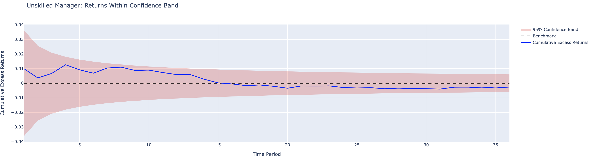
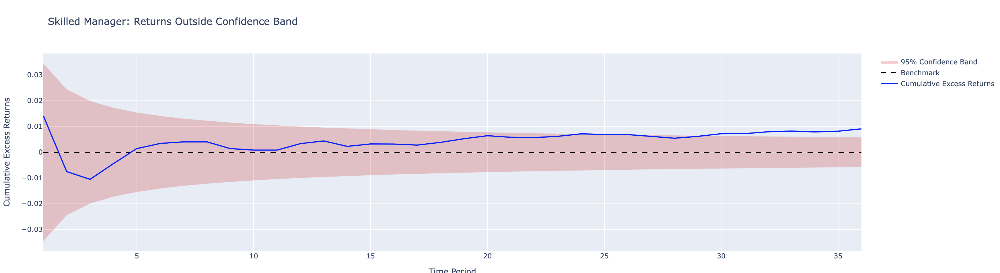

# Quality Control Chart for Manager Selection

## Source

This is based on the CFA III curriculum, 7.2 Quality Control Charts for Manager Selection. Sadly, I cannot share any content from the curriculum due to copyrights, but I can provide a summary of the key points.

## **1. Core Components of the Framework**

**Null Hypothesis (H0):**  
The baseline assumption is that the manager has no skills, meaning their expected excess return in the long term is sero. Any observed deviation from this baseline is attributed to random noise.

**Value-Added Return Calculation:**  
The chart tracks the cumulative annualised excess return of the manager over a benchmark. The formula is:
$$ \text{Excess Return} = R_{\text{Portfolio}} - R_{\text{Benchmark}} $$
This metric is plotted over time to visualise persistent outperformance or underperformance.

**Confidence Band Construction:**  
The funnel-shaped confidence band is derived from:  

- **Standard Deviation ($\sigma$):** Historical volatility of the manager's value-added returns.  
- **Time Adjustment:** The band gets narrowed down as the evaluation period lengthens, following:  

$$
\sigma_{\text{annualised}} = \frac{\sigma}{\sqrt{T}}
$$  

**Statistical Significance Threshold:**  
The band typically corresponds to a confidence interval. For a normal distribution, an 80% band uses ±1.28σ, while a 90% band uses ±1.645σ

## **2. Key Assumptions**

1. **Normality:** Excess returns follow a normal distribution
2. **Independence:** Returns are uncorrelated across periods (no serial correlation)
3. **Stationarity:** The manager’s risk profile (volatility) remains constant over time.

## **3. Interpretation Rules**

- **Within Band:** Performance aligns with the null hypothesis (no skill). Example: A +1% annualised excess return inside an 80% confidence band suggests results are statistically indistinguishable from luck
- **Outside Band:** Evidence to reject the null hypothesis. Example: A +5% annualised excess return breaching the upper band implies a <10% probability of occurring by chance, signaling potential skill

## **4. Limitations**

- **Model Sensitivity:** Relies heavily on accurate volatility estimates and normality assumptions, which may not be true in practices
- **Benchmark Choice:** Poor benchmark selection (e.g., using the S&P 500 for a niche strategy) can distort results
- **Short-Term Bias:** Requires multi-year data to minimise false positives

## Example Result

